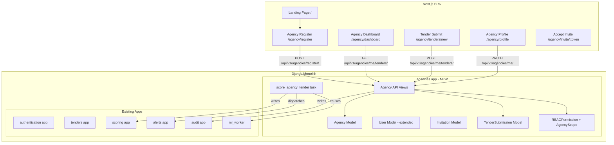
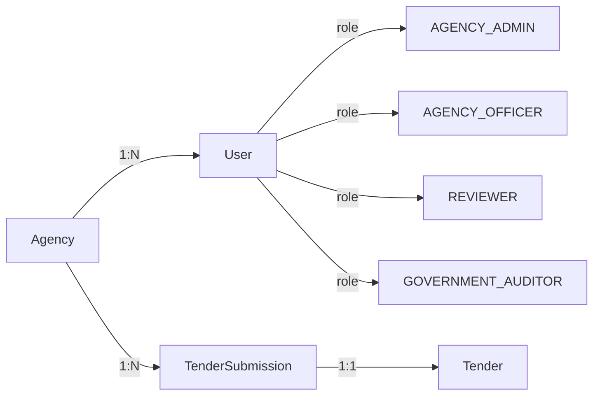

# Design Document: Agency Portal RBAC

## Overview

This document describes the technical design for the Agency Portal RBAC feature on TenderShield. The feature introduces multi-tenancy at the agency level, a four-role RBAC model, a public landing page, an agency dashboard, tender submission through the portal, and integration with the existing fraud detection pipeline.

The existing system is a Django monolith (DRF + SimpleJWT + Celery + MySQL) with a Next.js SPA frontend. The system currently has two internal roles (`AUDITOR`, `ADMIN`) and is single-tenant. This feature extends the `User` model, introduces an `Agency` model as the tenancy boundary, and adds four new roles without breaking existing functionality.

### Key Design Decisions

- **Single Django app (`agencies`)** — all new backend models, views, serializers, and tasks live in a new `agencies` app. This keeps the existing apps untouched and makes the feature independently deployable.
- **Queryset-level tenancy enforcement** — a custom `AgencyScopedManager` on `TenderSubmission` applies the `agency_id` filter at the ORM layer, not in views or serializers, satisfying Requirement 8.5.
- **JWT claim extension** — `agency_id` and `role` are injected into the JWT payload via a custom `AgencyTokenObtainPairSerializer`, so every downstream permission check is stateless.
- **`TenderSubmission` is a new model** — it wraps the existing `Tender` model rather than modifying it, preserving the existing fraud detection pipeline's data contract (Requirement 10.8).
- **Invitation tokens** — stored as HMAC-SHA256 hashes; the raw token is sent only in the email link, never persisted in plaintext.
- **Frontend route split** — the existing `/login` and internal dashboard routes are preserved; new agency routes live under `/agency/` prefix.

---

## Architecture



### Multi-Tenancy Boundary



---

## Components and Interfaces

### Backend: `agencies` Django App

#### New API Endpoints

| Method | Path | Roles | Description |
|--------|------|-------|-------------|
| POST | `/api/v1/agencies/register/` | Public | Agency registration |
| GET | `/api/v1/agencies/verify-email/` | Public | Email verification |
| POST | `/api/v1/agencies/me/invitations/` | AGENCY_ADMIN | Send invitation |
| GET | `/api/v1/agencies/me/invitations/accept/` | Public | Accept invitation |
| GET | `/api/v1/agencies/me/` | Agency roles | Get agency profile |
| PATCH | `/api/v1/agencies/me/` | AGENCY_ADMIN | Update agency profile |
| GET | `/api/v1/agencies/me/members/` | AGENCY_ADMIN | List members |
| PATCH | `/api/v1/agencies/me/members/:id/deactivate/` | AGENCY_ADMIN | Deactivate member |
| GET | `/api/v1/agencies/me/tenders/` | Agency roles | List agency tenders |
| POST | `/api/v1/agencies/me/tenders/` | AGENCY_ADMIN, AGENCY_OFFICER | Create tender |
| GET | `/api/v1/agencies/me/tenders/:id/` | Agency roles | Tender detail |
| PATCH | `/api/v1/agencies/me/tenders/:id/` | AGENCY_ADMIN, AGENCY_OFFICER | Edit draft tender |
| DELETE | `/api/v1/agencies/me/tenders/:id/` | AGENCY_ADMIN, AGENCY_OFFICER | Delete draft tender |
| POST | `/api/v1/agencies/me/tenders/:id/submit/` | AGENCY_ADMIN, AGENCY_OFFICER | Submit tender |
| GET | `/api/v1/agencies/tenders/` | GOVERNMENT_AUDITOR, ADMIN | Cross-agency tender list |
| PATCH | `/api/v1/agencies/tenders/:id/clear/` | GOVERNMENT_AUDITOR, ADMIN | Clear flagged tender |

#### RBAC Permission Classes

```python
# agencies/permissions.py

class IsAgencyRole(BasePermission):
    """Allows access only to users with an agency-scoped role."""
    allowed_roles = {UserRole.AGENCY_ADMIN, UserRole.AGENCY_OFFICER, UserRole.REVIEWER}

class IsAgencyAdmin(BasePermission):
    allowed_roles = {UserRole.AGENCY_ADMIN}

class IsAgencyOfficerOrAdmin(BasePermission):
    allowed_roles = {UserRole.AGENCY_ADMIN, UserRole.AGENCY_OFFICER}

class IsGovernmentAuditorOrAdmin(BasePermission):
    allowed_roles = {UserRole.GOVERNMENT_AUDITOR, UserRole.ADMIN}

class AgencyObjectPermission(BasePermission):
    """Object-level: ensures the resource's agency_id matches the user's agency_id."""
    def has_object_permission(self, request, view, obj):
        if request.user.role in (UserRole.GOVERNMENT_AUDITOR, UserRole.ADMIN):
            return True
        return obj.agency_id == request.user.agency_id
```

#### JWT Token Extension

The existing `LoginView` is extended to inject `agency_id` and `role` into the JWT payload:

```python
# agencies/serializers.py
class AgencyTokenObtainPairSerializer(TokenObtainPairSerializer):
    @classmethod
    def get_token(cls, user):
        token = super().get_token(user)
        token["role"] = user.role
        token["agency_id"] = str(user.agency_id) if user.agency_id else None
        return token
```

The existing `AuditingJWTAuthentication` is subclassed to also check agency suspension:

```python
# agencies/jwt_auth.py
class AgencyAwareJWTAuthentication(AuditingJWTAuthentication):
    def get_user(self, validated_token):
        user = super().get_user(validated_token)
        if user.agency and user.agency.status == AgencyStatus.SUSPENDED:
            raise AuthenticationFailed("Agency account is suspended.")
        return user
```

### Frontend: New Routes and Components

#### New Routes

```
/                          → Landing page (public)
/agency/register           → Agency registration form
/agency/verify-email       → Email verification landing
/agency/invite/:token      → Invitation acceptance form
/agency/dashboard          → Agency dashboard (authenticated)
/agency/tenders/new        → Create tender form
/agency/tenders/:id        → Tender detail
/agency/profile            → Agency profile management
```

#### Key Components

- `LandingPage` — marketing page with value propositions and CTA
- `AgencyRegistrationForm` — multi-step form with GSTIN validation
- `AgencyDashboard` — KPI cards + paginated tender list with filters
- `TenderSubmissionForm` — full tender creation/edit form
- `RiskBadge` — colour-coded badge (green/amber/red) based on fraud score
- `InviteMemberModal` — modal for Agency_Admin to send invitations
- `AgencyProfilePage` — profile view/edit + member list

#### Auth Context Extension

The existing `AuthContext` is extended to carry `agencyId` and the full role set:

```typescript
export type UserRole =
  | "AUDITOR"
  | "ADMIN"
  | "AGENCY_ADMIN"
  | "AGENCY_OFFICER"
  | "REVIEWER"
  | "GOVERNMENT_AUDITOR";

interface AuthState {
  accessToken: string | null;
  role: UserRole | null;
  agencyId: string | null;
  isAuthenticated: boolean;
  isLoading: boolean;
}
```

---

## Data Models

### `Agency` Model (new)

```python
class AgencyStatus(models.TextChoices):
    PENDING_APPROVAL = "PENDING_APPROVAL"
    ACTIVE = "ACTIVE"
    SUSPENDED = "SUSPENDED"

class Agency(models.Model):
    agency_id = models.UUIDField(default=uuid.uuid4, unique=True, editable=False)
    legal_name = models.CharField(max_length=500)
    gstin = models.CharField(max_length=15, unique=True)  # immutable after creation
    ministry = models.CharField(max_length=500)
    contact_name = models.CharField(max_length=255)
    contact_email = models.EmailField()
    status = models.CharField(max_length=20, choices=AgencyStatus.choices,
                               default=AgencyStatus.PENDING_APPROVAL)
    created_at = models.DateTimeField(auto_now_add=True)
    approved_at = models.DateTimeField(null=True, blank=True)

    class Meta:
        db_table = "agencies_agency"
```

### `User` Model Extension

The existing `User` model gains two new fields via a migration:

```python
# New fields added to authentication.User
agency = models.ForeignKey(
    "agencies.Agency",
    on_delete=models.SET_NULL,
    null=True, blank=True,
    related_name="members",
)
email_verified = models.BooleanField(default=False)
```

`UserRole.choices` is extended with the four new roles:

```python
class UserRole(models.TextChoices):
    AUDITOR = "AUDITOR"
    ADMIN = "ADMIN"
    AGENCY_ADMIN = "AGENCY_ADMIN"
    AGENCY_OFFICER = "AGENCY_OFFICER"
    REVIEWER = "REVIEWER"
    GOVERNMENT_AUDITOR = "GOVERNMENT_AUDITOR"
```

### `Invitation` Model (new)

```python
class Invitation(models.Model):
    token_hash = models.CharField(max_length=64, unique=True)  # SHA-256 hex of raw token
    email = models.EmailField()
    role = models.CharField(max_length=20)  # AGENCY_OFFICER | REVIEWER
    agency = models.ForeignKey(Agency, on_delete=models.CASCADE, related_name="invitations")
    invited_by = models.ForeignKey(settings.AUTH_USER_MODEL, on_delete=models.SET_NULL, null=True)
    expires_at = models.DateTimeField()
    consumed_at = models.DateTimeField(null=True, blank=True)
    created_at = models.DateTimeField(auto_now_add=True)

    class Meta:
        db_table = "agencies_invitation"

    @property
    def is_valid(self):
        return self.consumed_at is None and self.expires_at > timezone.now()
```

### `TenderSubmission` Model (new)

This model wraps the existing `Tender` model. When a submission is made, a `Tender` record is created and linked here. This preserves the existing pipeline's data contract.

```python
class SubmissionStatus(models.TextChoices):
    DRAFT = "DRAFT"
    SUBMITTED = "SUBMITTED"
    UNDER_REVIEW = "UNDER_REVIEW"
    FLAGGED = "FLAGGED"
    CLEARED = "CLEARED"

VALID_TRANSITIONS = {
    SubmissionStatus.DRAFT: {SubmissionStatus.SUBMITTED},
    SubmissionStatus.SUBMITTED: {SubmissionStatus.UNDER_REVIEW, SubmissionStatus.CLEARED},
    SubmissionStatus.UNDER_REVIEW: {SubmissionStatus.FLAGGED, SubmissionStatus.CLEARED},
    SubmissionStatus.FLAGGED: {SubmissionStatus.CLEARED},
    SubmissionStatus.CLEARED: set(),
}

class TenderSubmission(models.Model):
    agency = models.ForeignKey(Agency, on_delete=models.CASCADE, related_name="submissions")
    submitted_by = models.ForeignKey(settings.AUTH_USER_MODEL, on_delete=models.SET_NULL,
                                      null=True, related_name="submissions")
    tender = models.OneToOneField("tenders.Tender", on_delete=models.CASCADE,
                                   null=True, blank=True, related_name="submission")
    # Submission form fields (pre-pipeline)
    tender_ref = models.CharField(max_length=255)
    title = models.CharField(max_length=500)
    category = models.CharField(max_length=255)
    estimated_value = models.DecimalField(max_digits=20, decimal_places=2)
    submission_deadline = models.DateTimeField()
    publication_date = models.DateTimeField(null=True, blank=True)
    buyer_name = models.CharField(max_length=500)
    spec_text = models.TextField(blank=True, default="")
    status = models.CharField(max_length=20, choices=SubmissionStatus.choices,
                               default=SubmissionStatus.DRAFT)
    review_note = models.TextField(blank=True, default="")  # required when clearing FLAGGED
    created_at = models.DateTimeField(auto_now_add=True)
    updated_at = models.DateTimeField(auto_now=True)

    objects = AgencyScopedManager()  # custom manager — see Data Isolation section

    class Meta:
        db_table = "agencies_tendersubmission"
        indexes = [
            models.Index(fields=["agency", "status"]),
            models.Index(fields=["agency", "created_at"]),
        ]

    def transition_to(self, new_status, actor=None, review_note=""):
        if new_status not in VALID_TRANSITIONS.get(self.status, set()):
            raise ValueError(f"Invalid transition: {self.status} → {new_status}")
        old_status = self.status
        self.status = new_status
        if review_note:
            self.review_note = review_note
        self.save(update_fields=["status", "review_note", "updated_at"])
        # Write AuditLog
        AuditLog.objects.create(
            event_type=EventType.STATUS_CHANGED,
            user=actor,
            affected_entity_type="TenderSubmission",
            affected_entity_id=str(self.pk),
            data_snapshot={
                "previous_status": old_status,
                "new_status": new_status,
                "agency_id": str(self.agency_id),
            },
        )
```

### `AgencyScopedManager`

```python
class AgencyScopedManager(models.Manager):
    """
    Default manager that filters by agency when a request context is provided.
    Usage: TenderSubmission.objects.for_agency(agency_id)
    """
    def for_agency(self, agency_id):
        return self.get_queryset().filter(agency_id=agency_id)
```

### `EmailVerificationToken` Model (new)

```python
class EmailVerificationToken(models.Model):
    user = models.OneToOneField(settings.AUTH_USER_MODEL, on_delete=models.CASCADE)
    token_hash = models.CharField(max_length=64, unique=True)
    expires_at = models.DateTimeField()
    created_at = models.DateTimeField(auto_now_add=True)

    class Meta:
        db_table = "agencies_emailverificationtoken"
```

---

## Correctness Properties

*A property is a characteristic or behavior that should hold true across all valid executions of a system — essentially, a formal statement about what the system should do. Properties serve as the bridge between human-readable specifications and machine-verifiable correctness guarantees.*

### Property 1: Agency-scoped queryset never leaks cross-agency data

*For any* authenticated user with role `AGENCY_ADMIN`, `AGENCY_OFFICER`, or `REVIEWER`, every `TenderSubmission` returned by `TenderSubmission.objects.for_agency(user.agency_id)` SHALL have `agency_id` equal to `user.agency_id`.

**Validates: Requirements 8.1, 8.2, 3.2**

### Property 2: RBAC permission denial is exhaustive

*For any* user role and any API action, if the role is not in the permitted set for that action (as defined in the Role Permission Matrix), the permission check SHALL return `False`.

**Validates: Requirements 3.1, 3.2, 3.3, 3.6, 3.7, 3.8**

### Property 3: Tender submission status machine admits only valid transitions

*For any* `TenderSubmission` in any status `S`, calling `transition_to(T)` where `T` is not in `VALID_TRANSITIONS[S]` SHALL raise a `ValueError` and leave the submission status unchanged.

**Validates: Requirements 7.1, 7.2**

### Property 4: Invitation token round-trip

*For any* valid (unexpired, unconsumed) invitation, hashing the raw token with SHA-256 SHALL produce the stored `token_hash`, and looking up by that hash SHALL return the original invitation record.

**Validates: Requirements 4.1, 4.3, 4.4, 4.5**

### Property 5: GSTIN validation rejects all non-conforming strings

*For any* string that does not match the pattern `[0-9]{2}[A-Z]{5}[0-9]{4}[A-Z]{1}[1-9A-Z]{1}Z[0-9A-Z]{1}`, the GSTIN validator SHALL return an error; *for any* string that does match, it SHALL return valid.

**Validates: Requirements 2.7**

### Property 6: Suspended agency blocks all authentication

*For any* user whose `agency.status` is `SUSPENDED`, the `AgencyAwareJWTAuthentication.get_user()` method SHALL raise `AuthenticationFailed` regardless of the user's own `is_active` state.

**Validates: Requirements 2.5, 9.7**

### Property 7: bleach sanitisation is idempotent on clean input

*For any* string that contains no HTML tags or special characters, applying the bleach sanitisation pipeline SHALL return the original string unchanged.

**Validates: Requirements 6.11**

---

## Error Handling

### HTTP Error Responses

| Scenario | HTTP Status | Response body |
|----------|-------------|---------------|
| Cross-agency resource access | 403 | `{"detail": "You do not have permission to access this resource."}` |
| Role insufficient for action | 403 | `{"detail": "Your role does not permit this action."}` |
| Invalid status transition | 400 | `{"detail": "Invalid transition: DRAFT → FLAGGED"}` |
| Expired/consumed invitation | 410 | `{"detail": "This invitation has expired or has already been used."}` |
| GSTIN already registered | 400 | `{"detail": "An agency with this GSTIN is already registered."}` |
| Email already in use | 400 | `{"detail": "This email address is already associated with an account."}` |
| GSTIN update attempt | 400 | `{"detail": "GSTIN cannot be modified after registration."}` |
| Suspended agency login | 403 | `{"detail": "Your agency account is suspended. Contact support@tendershield.in."}` |
| Edit non-draft tender | 403 | `{"detail": "Only DRAFT tenders can be edited or deleted."}` |
| Submission deadline in past | 400 | `{"detail": "Submission deadline must be in the future."}` |

### Celery Task Failure Handling

The `score_agency_tender` task (wrapping the existing `score_tender` task) retries up to 3 times with exponential backoff. On permanent failure:
- `TenderSubmission.status` remains `SUBMITTED` (not advanced to `UNDER_REVIEW`)
- An `Alert` is created for all `ADMIN` users with `alert_type = SCORING_FAILURE`
- An `AuditLog` entry is written with the error details

### Email Delivery Failures

Invitation and verification emails use the existing `send_alert_email` retry pattern. If delivery fails after 3 retries, the `Invitation` or `EmailVerificationToken` record is marked `delivery_failed = True` and an internal alert is raised for `ADMIN` users.

### Audit Log on Permission Denial

Every HTTP 403 response from an RBAC permission check writes an `AuditLog` entry via a DRF exception handler hook:

```python
# agencies/exceptions.py
def agency_exception_handler(exc, context):
    response = exception_handler(exc, context)
    if response and response.status_code == 403:
        request = context.get("request")
        if request and request.user.is_authenticated:
            AuditLog.objects.create(
                event_type=EventType.PERMISSION_DENIED,
                user=request.user,
                affected_entity_type=context.get("view").__class__.__name__,
                affected_entity_id=str(context.get("kwargs", {}).get("pk", "")),
                data_snapshot={
                    "method": request.method,
                    "path": request.path,
                    "role": request.user.role,
                },
                ip_address=_get_ip(request),
            )
    return response
```

---

## Testing Strategy

### Unit Tests (pytest + Django test client)

- GSTIN regex validator: valid and invalid format examples
- `TenderSubmission.transition_to()`: all valid transitions succeed, all invalid transitions raise `ValueError`
- `AgencyScopedManager.for_agency()`: returns only records for the given agency
- `Invitation.is_valid`: expired and consumed invitations return `False`
- `AgencyAwareJWTAuthentication.get_user()`: suspended agency raises `AuthenticationFailed`
- bleach sanitisation: HTML tags are stripped from `title`, `spec_text`, `buyer_name`
- Role permission matrix: each role/action combination returns the expected boolean

### Property-Based Tests (Hypothesis, minimum 100 iterations each)

Each property test references its design property via a comment tag:
`# Feature: agency-portal-rbac, Property N: <property_text>`

- **Property 1** — Generate random `(agency_id_A, agency_id_B, list_of_submissions)` where submissions belong to `agency_id_A`. Assert `for_agency(agency_id_B)` returns empty when `agency_id_A != agency_id_B`.
- **Property 2** — Generate random `(role, action)` pairs. Assert `has_permission(role, action)` matches the permission matrix truth table.
- **Property 3** — Generate random `(current_status, target_status)` pairs. Assert `transition_to` raises `ValueError` iff `target_status not in VALID_TRANSITIONS[current_status]`.
- **Property 4** — Generate random 32-byte tokens. Assert `sha256(token).hexdigest() == stored_hash` and lookup by hash returns the correct record.
- **Property 5** — Generate random strings from the GSTIN alphabet. Assert the validator accepts exactly those matching the regex and rejects all others.
- **Property 6** — Generate random users with `agency.status = SUSPENDED`. Assert `get_user()` always raises `AuthenticationFailed`.
- **Property 7** — Generate random strings without HTML. Assert `bleach_clean(s) == s`.

### Integration Tests

- Full agency registration → email verification → login flow
- Invitation send → accept → new user created with correct role and agency
- Tender submission → Celery task enqueued → fraud score persisted → alert dispatched
- Cross-agency access attempt returns HTTP 403
- Government Auditor can read all agencies' tenders but cannot write
- Suspended agency user cannot authenticate

### Frontend Tests (Jest + React Testing Library)

- `RiskBadge` renders correct colour class for scores < 40, 40–69, ≥ 70
- `AgencyDashboard` filters tender list by status, category, date range
- `AgencyRegistrationForm` shows field-level errors for missing required fields
- `TenderSubmissionForm` rejects past submission deadlines client-side
