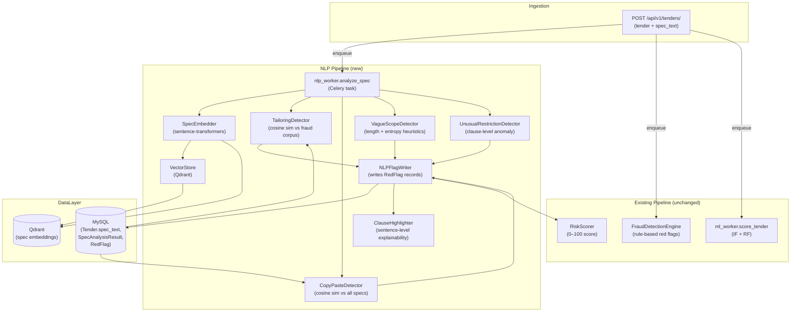
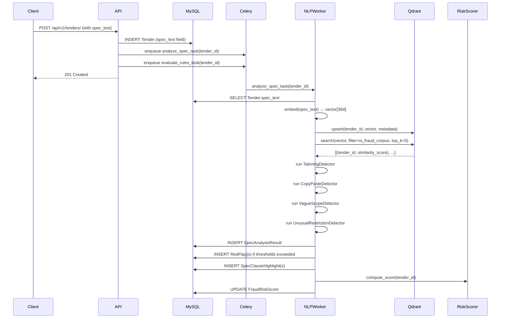
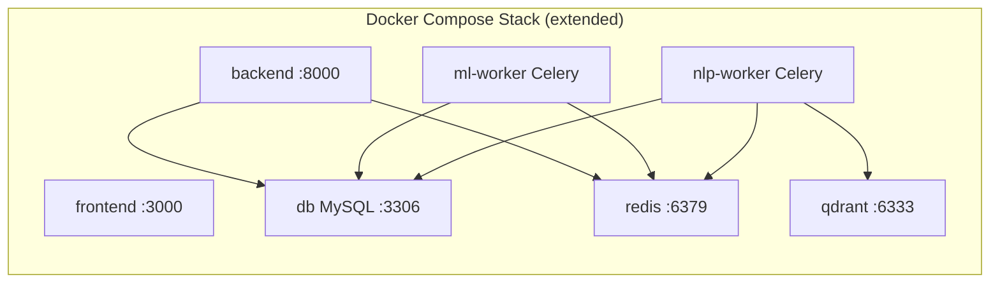
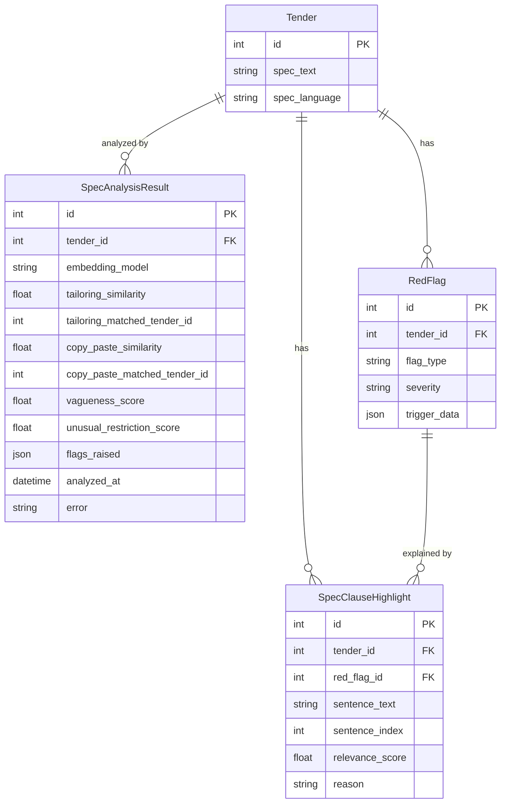

# Design Document: NLP Tender Specification Analysis

## Overview

NLP Tender Specification Analysis extends TenderShield with demand-side procurement fraud detection by analyzing the *text* of tender specifications — a blind spot in the current system. The current pipeline detects bid-rigging and collusion through numeric/categorical bid data; this feature adds a parallel NLP pipeline that embeds specification text using a multilingual sentence-transformer model and applies four complementary detectors: specification tailoring (specs written to exclude all but one vendor), copy-paste fraud (verbatim reuse of previously fraudulent specs), vague scope detection (intentionally ambiguous specs enabling post-award scope creep), and unusual restriction detection (statistically anomalous clauses for the tender's category).

The feature integrates as a Celery task that runs after tender ingestion alongside the existing ML scoring pipeline, raises four new `RedFlag` types (`SPEC_TAILORING`, `SPEC_COPY_PASTE`, `SPEC_VAGUE_SCOPE`, `SPEC_UNUSUAL_RESTRICTION`), contributes to the existing `FraudRiskScore`, and provides sentence-level explainability (the NLP equivalent of SHAP) by highlighting the specific clauses that triggered each flag.

---

## Architecture

### Component Integration



### Sequence Diagram — Tender Ingestion with NLP Analysis



### Deployment Architecture Addition

The NLP worker runs as a separate Docker Compose service (`nlp-worker`) sharing the same Redis broker and MySQL database. Qdrant runs as an additional service (`qdrant`).



---

## Components and Interfaces

### SpecEmbedder

Wraps the `sentence-transformers/paraphrase-multilingual-MiniLM-L12-v2` model. Produces 384-dimensional L2-normalized vectors. Singleton — model loaded once at worker startup.

```python
class SpecEmbedder:
    def embed(self, text: str) -> np.ndarray:
        """Return L2-normalized 384-dim embedding. Returns zero vector for empty text."""

    def embed_sentences(self, text: str) -> list[tuple[str, np.ndarray]]:
        """Split text into sentences and embed each. Returns [(sentence, vector), ...]."""
```

**Responsibilities:**
- Load model from local cache (no internet at inference time)
- Normalize all output vectors to unit length (required for cosine similarity via dot product)
- Handle empty/None text gracefully — return zero vector, never raise

### VectorStore

Thin wrapper around the Qdrant client. Collection name: `tender_specs`. Payload schema per point: `{tender_id, category, is_fraud_corpus, confirmed_fraud, ingested_at}`.

```python
class VectorStore:
    def upsert(self, tender_id: int, vector: np.ndarray, payload: dict) -> None:
        """Insert or update the embedding for a tender."""

    def search_similar(
        self,
        vector: np.ndarray,
        top_k: int = 10,
        filter_payload: dict | None = None,
    ) -> list[SimilarityResult]:
        """Return top-k most similar tenders with cosine similarity scores."""

    def mark_fraud_corpus(self, tender_id: int, confirmed_fraud: bool) -> None:
        """Update the is_fraud_corpus / confirmed_fraud flags for a tender."""
```

**Responsibilities:**
- Abstract Qdrant client from detectors
- Enforce collection creation with cosine distance metric on first use
- `search_similar` with `filter_payload={"is_fraud_corpus": True}` scopes search to known-fraud corpus

### TailoringDetector

Detects specification tailoring by comparing the new tender's embedding against the fraud corpus.

```python
class TailoringDetector:
    def __init__(self, threshold: float = 0.85):
        ...

    def detect(
        self,
        tender_id: int,
        vector: np.ndarray,
        category: str,
    ) -> DetectionResult | None:
        """
        Search fraud corpus for similar specs.
        Returns DetectionResult if max similarity >= threshold, else None.
        trigger_data includes: matched_tender_id, similarity_score, matched_sentences.
        """
```

### CopyPasteDetector

Detects near-verbatim reuse of any previously flagged or confirmed-fraud tender spec.

```python
class CopyPasteDetector:
    def __init__(self, threshold: float = 0.92):
        ...

    def detect(
        self,
        tender_id: int,
        vector: np.ndarray,
    ) -> DetectionResult | None:
        """
        Search all previously flagged specs (is_fraud_corpus=True OR confirmed_fraud=True).
        Returns DetectionResult if max similarity >= threshold, else None.
        """
```

### VagueScopeDetector

Detects intentionally vague specifications using text statistics relative to contract value.

```python
class VagueScopeDetector:
    def detect(
        self,
        tender_id: int,
        spec_text: str,
        estimated_value: Decimal,
        category: str,
    ) -> DetectionResult | None:
        """
        Compute vagueness score from: word count, type-token ratio, Shannon entropy,
        and value-normalized length. Flag if vagueness_score exceeds category baseline.
        """
```

### UnusualRestrictionDetector

Detects statistically anomalous clauses (brand-specific requirements, narrow geographic restrictions, non-standard certifications) by comparing sentence-level embeddings against a category-specific clause baseline.

```python
class UnusualRestrictionDetector:
    def detect(
        self,
        tender_id: int,
        sentences: list[tuple[str, np.ndarray]],
        category: str,
    ) -> DetectionResult | None:
        """
        For each sentence, compute its distance from the category centroid.
        Flag sentences whose distance exceeds the category's 95th-percentile threshold.
        Returns DetectionResult with the top anomalous clauses, or None.
        """
```

### NLPFlagWriter

Translates `DetectionResult` objects into `RedFlag` records and `SpecClauseHighlight` records.

```python
class NLPFlagWriter:
    def write_flags(
        self,
        tender_id: int,
        results: list[DetectionResult],
    ) -> list[RedFlag]:
        """
        For each non-None DetectionResult, create or update a RedFlag record.
        Also create SpecClauseHighlight records for sentence-level evidence.
        Clears previously active NLP flags for this tender before writing new ones.
        """
```

### ClauseHighlighter

Produces sentence-level highlights — the NLP equivalent of SHAP feature attribution.

```python
class ClauseHighlighter:
    def highlight(
        self,
        spec_text: str,
        flag_type: str,
        trigger_data: dict,
    ) -> list[ClauseHighlight]:
        """
        Return a ranked list of (sentence, relevance_score, reason) tuples
        that explain why the flag was raised.
        """
```

---

## Data Models

### Tender Model Extension

Add `spec_text` field to the existing `Tender` model:

```python
# backend/tenders/models.py — addition to Tender
spec_text = models.TextField(blank=True, default="")
spec_language = models.CharField(max_length=10, blank=True, default="")  # ISO 639-1, auto-detected
```

**Validation rules:**
- `spec_text` is optional at ingestion (existing tenders have no spec text)
- Maximum length: 100,000 characters (enforced at serializer level)
- `spec_language` is auto-detected by the NLP worker using `langdetect`; not user-supplied

### FlagType Extension

Add four new choices to `detection/models.py`:

```python
class FlagType(models.TextChoices):
    # ... existing values ...
    SPEC_TAILORING = "SPEC_TAILORING", "Specification Tailoring"
    SPEC_COPY_PASTE = "SPEC_COPY_PASTE", "Copy-Paste Fraud"
    SPEC_VAGUE_SCOPE = "SPEC_VAGUE_SCOPE", "Vague Scope"
    SPEC_UNUSUAL_RESTRICTION = "SPEC_UNUSUAL_RESTRICTION", "Unusual Restriction"

### SpecAnalysisResult

Stores the output of the NLP analysis pipeline for a tender. One row per analysis run (history preserved).

```python
class SpecAnalysisResult(models.Model):
    tender = models.ForeignKey("tenders.Tender", on_delete=models.CASCADE, related_name="spec_analyses")
    # Embedding metadata
    embedding_model = models.CharField(max_length=200, default="paraphrase-multilingual-MiniLM-L12-v2")
    embedding_dim = models.PositiveSmallIntegerField(default=384)
    spec_language = models.CharField(max_length=10, blank=True, default="")
    # Per-detector scores (null = detector did not run / insufficient data)
    tailoring_similarity = models.FloatField(null=True, blank=True)   # max cosine sim vs fraud corpus
    tailoring_matched_tender_id = models.IntegerField(null=True, blank=True)
    copy_paste_similarity = models.FloatField(null=True, blank=True)  # max cosine sim vs flagged specs
    copy_paste_matched_tender_id = models.IntegerField(null=True, blank=True)
    vagueness_score = models.FloatField(null=True, blank=True)        # 0.0–1.0, higher = vaguer
    unusual_restriction_score = models.FloatField(null=True, blank=True)  # 0.0–1.0
    # Flags raised
    flags_raised = models.JSONField(default=list)  # list of FlagType strings
    # Processing metadata
    analyzed_at = models.DateTimeField(default=timezone.now)
    analysis_duration_ms = models.PositiveIntegerField(null=True, blank=True)
    error = models.TextField(blank=True, default="")  # non-empty if analysis partially failed

    class Meta:
        db_table = "nlp_specanalysisresult"
        indexes = [
            models.Index(fields=["tender", "analyzed_at"]),
        ]
```

### SpecClauseHighlight

Stores sentence-level evidence for each NLP red flag — the explainability layer.

```python
class SpecClauseHighlight(models.Model):
    tender = models.ForeignKey("tenders.Tender", on_delete=models.CASCADE, related_name="clause_highlights")
    red_flag = models.ForeignKey("detection.RedFlag", on_delete=models.CASCADE, related_name="clause_highlights")
    sentence_text = models.TextField()
    sentence_index = models.PositiveSmallIntegerField()  # 0-based position in spec_text
    relevance_score = models.FloatField()                # 0.0–1.0, higher = more relevant to flag
    reason = models.CharField(max_length=500)            # human-readable explanation
    created_at = models.DateTimeField(default=timezone.now)

    class Meta:
        db_table = "nlp_specclausehighlight"
        ordering = ["-relevance_score"]
        indexes = [
            models.Index(fields=["tender", "red_flag"]),
        ]
```

### Entity Relationship Diagram (NLP additions)



---

## Algorithmic Pseudocode

### Main NLP Analysis Algorithm

```python
ALGORITHM analyze_spec(tender_id: int) -> SpecAnalysisResult
INPUT: tender_id — primary key of a Tender with spec_text
OUTPUT: SpecAnalysisResult persisted to DB; RedFlag records created as needed

PRECONDITIONS:
  - Tender with tender_id exists in DB
  - Tender.spec_text may be empty string (graceful degradation required)
  - SpecEmbedder model is loaded and ready

POSTCONDITIONS:
  - SpecAnalysisResult row inserted for tender_id
  - If spec_text is empty: no RedFlags raised, SpecAnalysisResult.error = "empty_spec"
  - If spec_text is non-empty: all four detectors run; RedFlags raised for each threshold exceeded
  - Tender embedding upserted to Qdrant
  - FraudRiskScore recomputed after flags written

LOOP INVARIANTS: N/A (no loops in main algorithm)

BEGIN
  tender ← Tender.objects.get(pk=tender_id)
  start_time ← now()

  # Graceful degradation: empty spec → no analysis, no false positives
  IF tender.spec_text == "" OR tender.spec_text IS NULL THEN
    INSERT SpecAnalysisResult(tender=tender, error="empty_spec", analyzed_at=now())
    RETURN  # EXIT — no flags raised for empty spec
  END IF

  # Step 1: Embed full spec and individual sentences
  vector ← embedder.embed(tender.spec_text)           # shape: (384,), L2-normalized
  sentences ← embedder.embed_sentences(tender.spec_text)  # [(text, vector), ...]

  # Step 2: Upsert embedding to Qdrant
  vector_store.upsert(
    tender_id=tender_id,
    vector=vector,
    payload={category: tender.category, is_fraud_corpus: False, ingested_at: now()}
  )

  # Step 3: Run all four detectors (independent, can run in parallel)
  results ← []
  results.append(tailoring_detector.detect(tender_id, vector, tender.category))
  results.append(copy_paste_detector.detect(tender_id, vector))
  results.append(vague_scope_detector.detect(tender_id, tender.spec_text, tender.estimated_value, tender.category))
  results.append(restriction_detector.detect(tender_id, sentences, tender.category))

  # Step 4: Write flags and highlights for non-None results
  non_null_results ← [r for r in results if r IS NOT None]
  flags ← flag_writer.write_flags(tender_id, non_null_results)

  # Step 5: Persist analysis result
  duration_ms ← (now() - start_time).milliseconds
  INSERT SpecAnalysisResult(
    tender=tender,
    tailoring_similarity=results[0].score if results[0] else None,
    copy_paste_similarity=results[1].score if results[1] else None,
    vagueness_score=results[2].score if results[2] else None,
    unusual_restriction_score=results[3].score if results[3] else None,
    flags_raised=[f.flag_type for f in flags],
    analyzed_at=now(),
    analysis_duration_ms=duration_ms
  )

  # Step 6: Trigger score recomputation
  compute_score_task.delay(tender_id)
END
```

### Tailoring Detection Algorithm

```python
ALGORITHM TailoringDetector.detect(tender_id, vector, category) -> DetectionResult | None
INPUT:
  - tender_id: int
  - vector: np.ndarray, shape (384,), L2-normalized
  - category: str
OUTPUT: DetectionResult with similarity score and matched sentences, or None

PRECONDITIONS:
  - vector is L2-normalized (||vector|| = 1.0)
  - threshold ∈ (0.0, 1.0]

POSTCONDITIONS:
  - IF result IS NOT None: result.score >= self.threshold
  - IF result IS None: no fraud-corpus spec has similarity >= self.threshold to vector
  - Similarity computation is symmetric: sim(A,B) == sim(B,A)

BEGIN
  # Search fraud corpus only
  hits ← vector_store.search_similar(
    vector=vector,
    top_k=5,
    filter_payload={"is_fraud_corpus": True}
  )

  IF hits IS EMPTY THEN
    RETURN None
  END IF

  best_hit ← hits[0]  # highest similarity (Qdrant returns sorted descending)

  IF best_hit.similarity < self.threshold THEN
    RETURN None
  END IF

  # Find which sentences drove the similarity (clause-level explainability)
  matched_sentences ← find_matching_sentences(
    tender_id=tender_id,
    matched_tender_id=best_hit.tender_id,
    top_k=3
  )

  RETURN DetectionResult(
    flag_type=SPEC_TAILORING,
    severity=HIGH,
    score=best_hit.similarity,
    trigger_data={
      "matched_tender_id": best_hit.tender_id,
      "similarity_score": best_hit.similarity,
      "threshold": self.threshold,
      "matched_sentences": matched_sentences,
    }
  )
END
```

### Vague Scope Detection Algorithm

```python
ALGORITHM VagueScopeDetector.detect(tender_id, spec_text, estimated_value, category) -> DetectionResult | None
INPUT:
  - spec_text: str (non-empty, pre-checked by caller)
  - estimated_value: Decimal
  - category: str
OUTPUT: DetectionResult if vagueness_score exceeds category baseline, else None

PRECONDITIONS:
  - spec_text is non-empty (caller guarantees this)
  - estimated_value > 0

POSTCONDITIONS:
  - vagueness_score ∈ [0.0, 1.0]
  - IF result IS NOT None: vagueness_score > category_baseline_95th_percentile
  - Monotonic relationship: shorter spec with lower entropy → higher vagueness_score

BEGIN
  words ← tokenize(spec_text)
  word_count ← len(words)
  unique_words ← len(set(words))

  # Type-token ratio: low TTR = repetitive/generic language
  ttr ← unique_words / word_count IF word_count > 0 ELSE 0.0

  # Shannon entropy of word distribution: low entropy = few distinct concepts
  word_freq ← frequency_distribution(words)
  entropy ← -sum(p * log2(p) for p in word_freq.values())

  # Value-normalized length: high-value contracts with very short specs are suspicious
  # Normalize: expected ~50 words per 100,000 INR of contract value (empirical baseline)
  value_normalized_length ← word_count / (float(estimated_value) / 100_000 + 1)

  # Composite vagueness score (higher = vaguer)
  # Invert TTR and entropy (low values = high vagueness)
  # Normalize value_normalized_length (low = high vagueness for high-value contracts)
  raw_score ← (
    (1.0 - min(ttr, 1.0)) * 0.35
    + (1.0 - min(entropy / 10.0, 1.0)) * 0.35
    + (1.0 - min(value_normalized_length / 100.0, 1.0)) * 0.30
  )
  vagueness_score ← clamp(raw_score, 0.0, 1.0)

  # Compare against category baseline (95th percentile of historical scores)
  baseline ← get_category_vagueness_baseline(category)  # default 0.70 if no history

  IF vagueness_score <= baseline THEN
    RETURN None
  END IF

  RETURN DetectionResult(
    flag_type=SPEC_VAGUE_SCOPE,
    severity=MEDIUM,
    score=vagueness_score,
    trigger_data={
      "vagueness_score": vagueness_score,
      "word_count": word_count,
      "type_token_ratio": ttr,
      "entropy": entropy,
      "value_normalized_length": value_normalized_length,
      "category_baseline": baseline,
    }
  )
END
```

---

## Key Functions with Formal Specifications

### SpecEmbedder.embed()

```python
def embed(self, text: str) -> np.ndarray:
```

**Preconditions:**
- `text` is a string (may be empty)
- Model is loaded (checked at worker startup)

**Postconditions:**
- Returns `np.ndarray` of shape `(384,)` and dtype `float32`
- If `text == ""`: returns `np.zeros(384, dtype=float32)` — never raises
- If `text` is non-empty: `np.linalg.norm(result) ≈ 1.0` (L2-normalized, tolerance 1e-5)
- Identical inputs always produce identical outputs (deterministic)

**Loop Invariants:** N/A

---

### cosine_similarity(a, b)

```python
def cosine_similarity(a: np.ndarray, b: np.ndarray) -> float:
```

**Preconditions:**
- `a` and `b` are L2-normalized vectors of the same shape
- `np.linalg.norm(a) ≈ 1.0` and `np.linalg.norm(b) ≈ 1.0`

**Postconditions:**
- Returns `float` in `[-1.0, 1.0]`
- `cosine_similarity(a, a) == 1.0` (identical vectors)
- `cosine_similarity(a, b) == cosine_similarity(b, a)` (symmetry)
- For L2-normalized vectors: `cosine_similarity(a, b) == float(np.dot(a, b))`

**Loop Invariants:** N/A

---

### TailoringDetector.detect() / CopyPasteDetector.detect()

**Preconditions:**
- `vector` is L2-normalized
- `threshold ∈ (0.0, 1.0]`
- Qdrant collection exists and is reachable

**Postconditions:**
- If result is not `None`: `result.score >= self.threshold`
- If result is `None`: no corpus entry has similarity `>= self.threshold` to `vector`
- A spec flagged as `SPEC_COPY_PASTE` has `copy_paste_similarity >= copy_paste_threshold` in `SpecAnalysisResult`
- A spec NOT flagged has `copy_paste_similarity < copy_paste_threshold` for all corpus entries

**Loop Invariants:** N/A

---

### VagueScopeDetector.detect()

**Preconditions:**
- `spec_text` is non-empty (caller guarantees)
- `estimated_value > 0`

**Postconditions:**
- `vagueness_score ∈ [0.0, 1.0]`
- Monotonic: shorter `spec_text` with lower entropy → higher `vagueness_score`
- If `spec_text == ""` (should not reach here): returns `None` (no false positive)

**Loop Invariants:**
- During word frequency computation: all processed words have been counted exactly once

---

### NLPFlagWriter.write_flags()

**Preconditions:**
- `tender_id` refers to an existing `Tender`
- `results` is a list of `DetectionResult` objects (may be empty)

**Postconditions:**
- All previously active NLP `RedFlag` records for `tender_id` are cleared before new ones are written
- Exactly one `RedFlag` is created per non-`None` `DetectionResult`
- `SpecClauseHighlight` records are created for each flag with sentence-level evidence
- If `results` is empty: no `RedFlag` records are created (no false positives)

**Loop Invariants:**
- For each result processed: all previously processed results have corresponding `RedFlag` records

---

## Example Usage

```python
# 1. Tender ingestion with spec_text (API layer)
tender = Tender.objects.create(
    tender_id="TND-2025-001",
    title="Supply of Laboratory Equipment",
    category="Scientific Equipment",
    estimated_value=Decimal("5000000.00"),
    spec_text=(
        "The supplier must have supplied to Ministry of Health in the last 6 months. "
        "Equipment must carry XYZ-brand certification. "
        "Delivery within 7 days of award."
    ),
)
# Enqueue NLP analysis (runs after tender creation)
analyze_spec_task.delay(tender.id)

# 2. Checking analysis results
result = SpecAnalysisResult.objects.filter(tender=tender).latest("analyzed_at")
print(result.flags_raised)
# → ["SPEC_TAILORING", "SPEC_UNUSUAL_RESTRICTION"]
print(result.tailoring_similarity)
# → 0.91

# 3. Retrieving clause-level highlights for explainability
highlights = SpecClauseHighlight.objects.filter(
    tender=tender,
    red_flag__flag_type="SPEC_TAILORING"
).order_by("-relevance_score")
for h in highlights:
    print(f"[{h.relevance_score:.2f}] {h.sentence_text}")
    print(f"  Reason: {h.reason}")
# → [0.94] "The supplier must have supplied to Ministry of Health in the last 6 months."
# →   Reason: "Highly similar to clause in confirmed-fraud tender TND-2024-087"

# 4. Marking a tender as confirmed fraud (adds to fraud corpus)
vector_store.mark_fraud_corpus(tender_id=tender.id, confirmed_fraud=True)

# 5. Graceful degradation — empty spec produces no flags
tender_no_spec = Tender.objects.create(
    tender_id="TND-2025-002",
    spec_text="",  # no spec text available
    ...
)
analyze_spec_task.delay(tender_no_spec.id)
result = SpecAnalysisResult.objects.filter(tender=tender_no_spec).latest("analyzed_at")
assert result.error == "empty_spec"
assert result.flags_raised == []
assert not RedFlag.objects.filter(tender=tender_no_spec, flag_type__startswith="SPEC_").exists()
```

---

## Correctness Properties

*A property is a characteristic or behavior that should hold true across all valid executions of a system — essentially, a formal statement about what the system should do. Properties serve as the bridge between human-readable specifications and machine-verifiable correctness guarantees.*

### Property 1: Identical Spec Texts Produce Similarity Score of 1.0

*For any* non-empty spec text `t`, embedding `t` twice and computing cosine similarity must yield exactly `1.0`.

```python
# Validates: SpecEmbedder determinism + L2 normalization + cosine similarity identity
v1 = embedder.embed(t)
v2 = embedder.embed(t)
assert cosine_similarity(v1, v2) == pytest.approx(1.0, abs=1e-5)
```

**Validates: Requirements 3.2, 3.3**

---

### Property 2: Similarity is Symmetric

*For any* two spec texts `a` and `b`, `sim(embed(a), embed(b)) == sim(embed(b), embed(a))`.

```python
# Validates: cosine similarity symmetry
assert cosine_similarity(embed(a), embed(b)) == pytest.approx(
    cosine_similarity(embed(b), embed(a)), abs=1e-6
)
```

**Validates: Requirements 3.2**

---

### Property 3: SPEC_COPY_PASTE Flag Implies Similarity >= Threshold

*For any* tender flagged with `SPEC_COPY_PASTE`, the `copy_paste_similarity` in `SpecAnalysisResult` must be `>= copy_paste_threshold`.

```python
# Validates: CopyPasteDetector threshold enforcement
for result in SpecAnalysisResult.objects.filter(flags_raised__contains="SPEC_COPY_PASTE"):
    assert result.copy_paste_similarity >= COPY_PASTE_THRESHOLD
```

**Validates: Requirements 5.1, 5.4**

---

### Property 4: Absence of SPEC_COPY_PASTE Flag Implies Similarity < Threshold

*For any* tender NOT flagged with `SPEC_COPY_PASTE`, the `copy_paste_similarity` must be `< copy_paste_threshold` (or `None` if corpus is empty).

```python
# Validates: no false positives from CopyPasteDetector
for result in SpecAnalysisResult.objects.exclude(flags_raised__contains="SPEC_COPY_PASTE"):
    assert result.copy_paste_similarity is None or result.copy_paste_similarity < COPY_PASTE_THRESHOLD
```

**Validates: Requirements 5.2, 5.5**

---

### Property 5: Vagueness Score is Monotonically Related to Spec Length and Entropy

*For any* two specs `s1` and `s2` with the same `estimated_value` and `category`, if `word_count(s1) < word_count(s2)` and `entropy(s1) <= entropy(s2)`, then `vagueness_score(s1) >= vagueness_score(s2)`.

```python
# Validates: VagueScopeDetector monotonicity
# (tested via property-based test with Hypothesis)
@given(
    s1=short_low_entropy_spec_strategy(),
    s2=long_high_entropy_spec_strategy(),
)
def test_vagueness_monotonicity(s1, s2):
    score1 = compute_vagueness_score(s1, estimated_value, category)
    score2 = compute_vagueness_score(s2, estimated_value, category)
    assert score1 >= score2
```

**Validates: Requirements 6.1, 6.4**

---

### Property 6: Empty Spec Never Produces a False Positive Flag

*For any* tender with `spec_text == ""` or `spec_text is None`, no NLP `RedFlag` of any type (`SPEC_*`) must be raised.

```python
# Validates: graceful degradation — zero text → zero flags
tender = create_tender(spec_text="")
analyze_spec(tender.id)
nlp_flags = RedFlag.objects.filter(
    tender=tender,
    flag_type__in=["SPEC_TAILORING", "SPEC_COPY_PASTE", "SPEC_VAGUE_SCOPE", "SPEC_UNUSUAL_RESTRICTION"]
)
assert nlp_flags.count() == 0
```

**Validates: Requirements 2.2, 11.5**

---

### Property 7: NLP Flags Contribute to FraudRiskScore

*For any* tender where at least one NLP `RedFlag` is raised, the `FraudRiskScore` after NLP analysis must be `>= FraudRiskScore` before NLP analysis (scores are non-decreasing when flags are added).

```python
# Validates: RiskScorer integration with NLP flags
score_before = get_latest_score(tender_id)
# ... NLP analysis runs and raises flags ...
score_after = get_latest_score(tender_id)
assert score_after >= score_before
```

**Validates: Requirements 9.2, 9.3**

---

## Error Handling

### Empty or Missing Spec Text

**Condition:** `Tender.spec_text` is empty string or `None` at analysis time.
**Response:** Insert `SpecAnalysisResult` with `error="empty_spec"`, raise no flags.
**Recovery:** When spec text is later added (via PATCH), re-enqueue `analyze_spec_task`.

### Qdrant Unavailable

**Condition:** Qdrant service is unreachable when `VectorStore.upsert()` or `search_similar()` is called.
**Response:** Log error, set `SpecAnalysisResult.error="qdrant_unavailable"`, skip vector-based detectors (tailoring, copy-paste, unusual restriction). `VagueScopeDetector` still runs (text-only, no Qdrant dependency).
**Recovery:** Celery task retries up to 3 times with exponential backoff. If all retries fail, the task is marked as failed and an `AuditLog` entry is written.

### Model Load Failure

**Condition:** `sentence-transformers` model files are missing or corrupted.
**Response:** Worker fails to start; Docker health check fails; alert raised via existing `AlertSystem`.
**Recovery:** Re-pull model files from Hugging Face Hub (or local model cache) and restart the `nlp-worker` container.

### Partial Analysis Failure

**Condition:** One detector raises an unhandled exception (e.g., malformed spec text causes tokenizer error).
**Response:** Log exception, record error in `SpecAnalysisResult.error`, continue running remaining detectors. Never let one detector failure block others.
**Recovery:** Automatic — remaining detectors complete; failed detector result is `None` (no flag raised for that type).

### Oversized Spec Text

**Condition:** `spec_text` exceeds 100,000 characters.
**Response:** Serializer rejects at API layer with HTTP 422 and `VALIDATION_ERROR` code.
**Recovery:** Client must truncate or split the spec text before resubmitting.

---

## Testing Strategy

### Unit Testing Approach

Each detector is tested in isolation with mocked `VectorStore` and `SpecEmbedder`:

- `TailoringDetector`: mock `search_similar` to return controlled similarity scores; verify flag raised/not raised at boundary values (threshold - ε, threshold, threshold + ε).
- `CopyPasteDetector`: same pattern; verify `copy_paste_similarity` stored correctly.
- `VagueScopeDetector`: test with known short/long/high-entropy/low-entropy texts; verify monotonicity.
- `UnusualRestrictionDetector`: mock sentence embeddings; verify anomalous sentences are identified.
- `NLPFlagWriter`: verify idempotency (re-running clears old flags before writing new ones).
- `SpecEmbedder`: verify zero vector for empty input; verify L2 normalization for non-empty input.

### Property-Based Testing Approach

**Property Test Library:** `hypothesis` (already used in the project — see `backend/.hypothesis/`)

Key property tests:

```python
from hypothesis import given, strategies as st

@given(text=st.text(min_size=1, max_size=10000))
def test_embed_always_normalized(text):
    v = embedder.embed(text)
    assert abs(np.linalg.norm(v) - 1.0) < 1e-5

@given(a=st.text(min_size=1), b=st.text(min_size=1))
def test_similarity_symmetric(a, b):
    sim_ab = cosine_similarity(embedder.embed(a), embedder.embed(b))
    sim_ba = cosine_similarity(embedder.embed(b), embedder.embed(a))
    assert abs(sim_ab - sim_ba) < 1e-6

@given(text=st.text(min_size=0, max_size=0))
def test_empty_spec_no_flags(text):
    # Empty spec must never produce flags
    result = analyze_spec_sync(create_tender(spec_text=text))
    assert result.flags_raised == []
```

### Integration Testing Approach

- End-to-end test: POST tender with known-fraudulent spec text → verify `SPEC_TAILORING` flag raised and `SpecClauseHighlight` records created.
- Qdrant integration: use a test Qdrant instance (Docker); verify upsert and search round-trip.
- Score integration: verify `FraudRiskScore` increases after NLP flags are raised.
- Celery task: use `CELERY_TASK_ALWAYS_EAGER=True` in test settings for synchronous execution.

---

## Performance Considerations

- **Model loading:** `sentence-transformers` model (~120 MB) is loaded once at worker startup and kept in memory. Inference for a single spec takes ~50–200 ms on CPU.
- **Batch embedding:** For bulk tender ingestion, `SpecEmbedder` supports `embed_batch(texts: list[str])` using the model's native batching (32 texts per batch by default).
- **Qdrant search latency:** With up to 1M vectors, approximate nearest-neighbor search returns in <10 ms. Exact search (used for small corpora <10K) returns in <50 ms.
- **Celery concurrency:** `nlp-worker` runs with `--concurrency=2` (CPU-bound; 2 workers per CPU core). Separate from `ml-worker` to avoid resource contention.
- **Vague scope detector:** Pure Python text statistics — <5 ms per spec. No external dependencies.

---

## Security Considerations

- **Spec text injection:** `spec_text` is stored as plain text in MySQL and never executed. Rendered in the frontend using React's default escaping (no `dangerouslySetInnerHTML`).
- **Qdrant access:** Qdrant is not exposed outside the Docker network. Only `nlp-worker` and `backend` services can reach it on port 6333.
- **Model supply chain:** The `paraphrase-multilingual-MiniLM-L12-v2` model is downloaded once during Docker image build and baked into the image. No runtime downloads. SHA256 checksum verified at build time.
- **Fraud corpus poisoning:** Only `ADMIN` role can call `mark_fraud_corpus()` via `POST /api/v1/tenders/{id}/mark-fraud-corpus/`. Auditors cannot modify the corpus.

---

## Dependencies

| Dependency | Version | Purpose |
|-----------|---------|---------|
| `sentence-transformers` | ≥2.7 | Multilingual spec embedding |
| `qdrant-client` | ≥1.9 | Vector store client |
| `langdetect` | ≥1.0.9 | Auto-detect spec language |
| `nltk` | ≥3.8 | Sentence tokenization |
| `numpy` | ≥1.26 | Vector operations |
| `hypothesis` | ≥6.x | Property-based testing (already present) |
| Qdrant | ≥1.9 (Docker) | Vector database service |

All Python dependencies are added to `ml_worker/requirements.txt`. Qdrant is added as a new service in `docker-compose.yml`.
