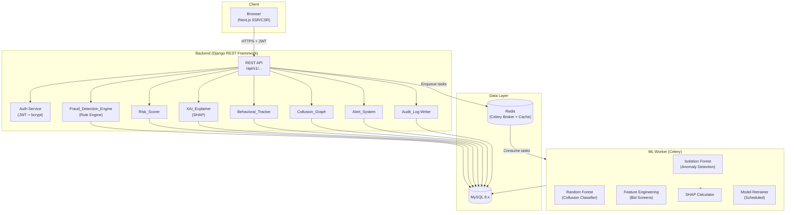
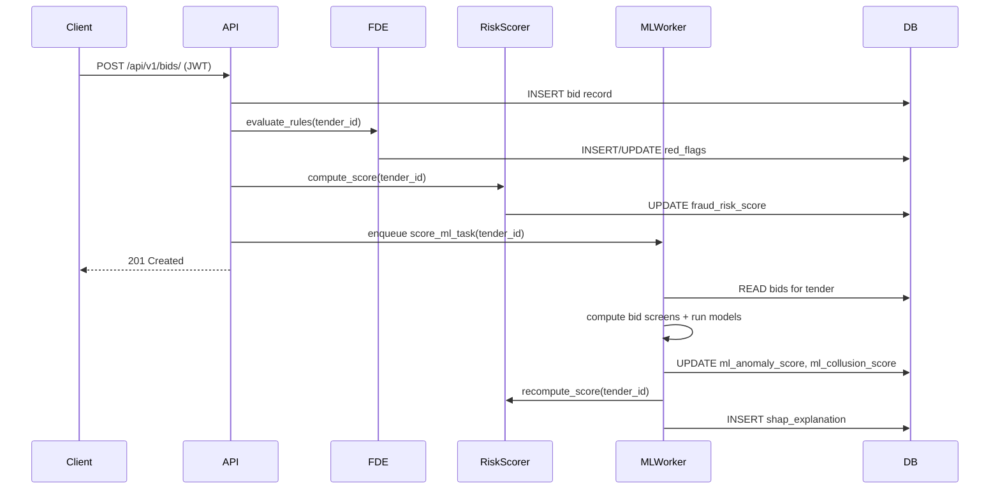
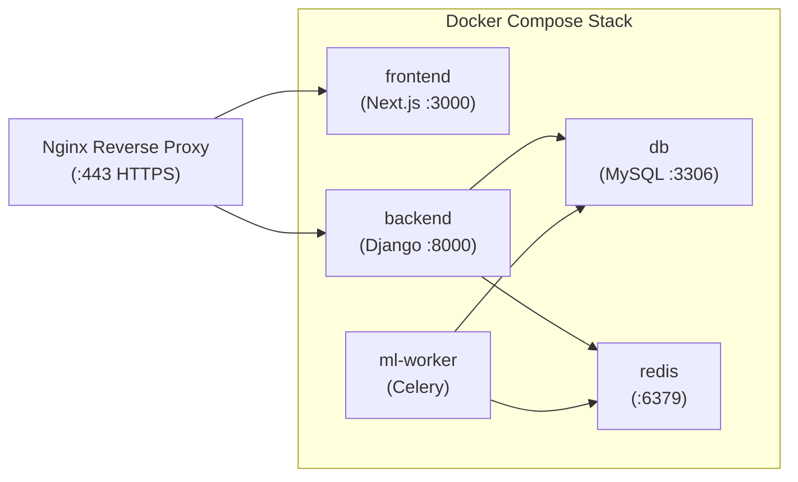
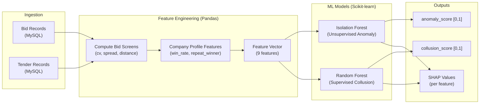

# Design Document: TenderShield

## Overview

TenderShield is an AI-powered government tender fraud detection platform. It ingests procurement data (tenders and bids), applies a hybrid rule-based and machine learning pipeline to detect bid-rigging, collusion, price-fixing, and other procurement fraud patterns, and surfaces actionable intelligence to auditors through a web dashboard.

The system is designed around three core principles:

1. **Explainability** — every fraud score is backed by SHAP attributions and plain-language justifications, satisfying the EU AI Act (L4) and enabling auditors to present evidence to oversight bodies.
2. **Auditability** — all system actions are written to an immutable audit log, satisfying RTI (L3) and Indian Competition Act (L1) requirements.
3. **Advisoriness** — scores are advisory only; human review is required before any legal action, as mandated by L1.

### Technology Stack

| Layer | Technology |
|-------|-----------|
| Frontend | Next.js (React), Tailwind CSS, D3.js / vis-network |
| Backend API | Django 4.x + Django REST Framework |
| ML Worker | Python 3.11, Scikit-learn, Pandas, SHAP, Celery |
| Database | MySQL 8.x |
| Message Broker | Redis (Celery broker) |
| Containerization | Docker, Docker Compose |
| CI/CD | GitHub Actions |

---

## Architecture

### High-Level Architecture



### Request Flow — Bid Ingestion



### Deployment Architecture



---

## Components and Interfaces

### Fraud_Detection_Engine

Responsible for evaluating all rule-based red flag checks against a tender and its bids.

**Interface:**
```python
class FraudDetectionEngine:
    def evaluate_rules(self, tender_id: int) -> list[RedFlag]:
        """Evaluate all active rules for a tender. Returns list of raised RedFlags."""

    def get_active_rules(self) -> list[RuleDefinition]:
        """Return all currently active rule definitions (hot-reloadable)."""

    def add_rule(self, rule: RuleDefinition) -> None:
        """Add a new rule definition without system restart."""
```

Rules are stored in the database as `RuleDefinition` records, loaded at startup and refreshed on each evaluation cycle, satisfying Requirement 3.8 (no restart required).

### Risk_Scorer

Aggregates rule-based red flags and ML scores into a single 0–100 integer.

**Scoring Formula (default weights):**
```
score = min(100, max(0,
    sum(HIGH_flag × 25, MEDIUM_flag × 10, capped at 50)
    + ml_anomaly_score × 30
    + ml_collusion_score × 20
))
```

**Interface:**
```python
class RiskScorer:
    def compute_score(self, tender_id: int, weights: ScoringWeights | None = None) -> FraudRiskScore:
        """Compute and persist the fraud risk score for a tender."""

    def get_score(self, tender_id: int) -> FraudRiskScore:
        """Retrieve the current score for a tender."""
```

### XAI_Explainer

Generates SHAP attributions and plain-language explanations for each scored tender.

**Interface:**
```python
class XAIExplainer:
    def explain(self, tender_id: int, model_version: str) -> Explanation:
        """Generate SHAP values and top-5 plain-language factors."""

    def fallback_explain(self, tender_id: int) -> Explanation:
        """Return red-flag-only explanation when SHAP computation fails."""
```

Plain-language templates are parameterized strings, e.g.:
- `"Winning bid was {pct}% below the estimated value."`
- `"Only {n} bidder(s) submitted bids for this tender."`
- `"Bidder {name} has won {pct}% of tenders in category {cat} in the past 12 months."`

### Behavioral_Tracker

Maintains longitudinal company risk profiles, updated asynchronously via Celery tasks.

**Interface:**
```python
class BehavioralTracker:
    def update_profile(self, bidder_id: int) -> CompanyProfile:
        """Recompute all metrics for a bidder and persist."""

    def get_profile(self, bidder_id: int) -> CompanyProfile:
        """Retrieve the current company risk profile."""

    def flag_high_risk(self, bidder_id: int, reason: str) -> None:
        """Set company status to HIGH_RISK with reason."""
```

### Collusion_Graph

Builds and maintains a graph of bidder relationships. Stored as adjacency data in MySQL (nodes + edges tables), rendered client-side using vis-network.

**Interface:**
```python
class CollusionGraph:
    def update_graph(self, tender_id: int) -> None:
        """Add/update nodes and edges for all bidders in a tender."""

    def detect_collusion_rings(self) -> list[CollusionRing]:
        """Find connected components with 3+ nodes on HIGH-severity edges."""

    def get_graph_data(self, filters: GraphFilter | None = None) -> GraphData:
        """Return nodes and edges for frontend rendering."""
```

### Alert_System

Sends in-app and email notifications when score thresholds are crossed.

**Interface:**
```python
class AlertSystem:
    def check_and_alert(self, tender_id: int) -> list[Alert]:
        """Evaluate threshold rules and dispatch alerts if triggered."""

    def retry_failed_emails(self) -> None:
        """Celery beat task: retry failed email deliveries (max 3 attempts)."""
```

---

## Data Models

### Entity Relationship Diagram

```mermaid
erDiagram
    User {
        int id PK
        string username
        string email
        string password_hash
        string role
        int failed_login_attempts
        datetime locked_until
        datetime created_at
    }

    Tender {
        int id PK
        string tender_id UK
        string title
        string category
        decimal estimated_value
        string currency
        datetime submission_deadline
        string buyer_id
        string buyer_name
        string status
        datetime created_at
        datetime updated_at
    }

    Bid {
        int id PK
        string bid_id UK
        int tender_id FK
        int bidder_id FK
        decimal bid_amount
        datetime submission_timestamp
        datetime created_at
    }

    Bidder {
        int id PK
        string bidder_id UK
        string bidder_name
        string registered_address
        string director_names
        datetime created_at
        datetime updated_at
    }

    RedFlag {
        int id PK
        int tender_id FK
        int bidder_id FK
        string flag_type
        string severity
        string rule_version
        json trigger_data
        bool is_active
        datetime raised_at
        datetime cleared_at
    }

    FraudRiskScore {
        int id PK
        int tender_id FK
        int score
        decimal ml_anomaly_score
        decimal ml_collusion_score
        int red_flag_contribution
        string model_version
        json weight_config
        datetime computed_at
    }

    CompanyProfile {
        int id PK
        int bidder_id FK
        int total_bids
        int total_wins
        decimal win_rate
        decimal avg_bid_deviation
        int active_red_flag_count
        int highest_fraud_risk_score
        string risk_status
        string collusion_ring_id FK
        datetime updated_at
    }

    CollusionRing {
        int id PK
        string ring_id UK
        json member_bidder_ids
        int member_count
        datetime detected_at
        bool is_active
    }

    GraphNode {
        int id PK
        int bidder_id FK
        json metadata
        datetime updated_at
    }

    GraphEdge {
        int id PK
        int source_node_id FK
        int target_node_id FK
        string edge_type
        int tender_id FK
        json metadata
        datetime created_at
    }

    Alert {
        int id PK
        int tender_id FK
        int user_id FK
        string alert_type
        int fraud_risk_score
        json top_red_flags
        string delivery_status
        int retry_count
        datetime created_at
        datetime delivered_at
    }

    AuditLog {
        int id PK
        string event_type
        datetime timestamp
        int user_id FK
        string affected_entity_type
        int affected_entity_id
        json data_snapshot
        string ip_address
    }

    RuleDefinition {
        int id PK
        string rule_code UK
        string description
        string severity
        bool is_active
        json parameters
        datetime created_at
        datetime updated_at
    }

    MLModelVersion {
        int id PK
        string model_type
        string version
        datetime trained_at
        json feature_importances
        string model_artifact_path
        bool is_active
    }

    SHAPExplanation {
        int id PK
        int tender_id FK
        string model_version
        string rule_engine_version
        json shap_values
        json top_factors
        bool shap_failed
        datetime computed_at
    }

    Tender ||--o{ Bid : "receives"
    Bidder ||--o{ Bid : "submits"
    Tender ||--o{ RedFlag : "has"
    Bidder ||--o{ RedFlag : "associated with"
    Tender ||--|| FraudRiskScore : "has"
    Bidder ||--|| CompanyProfile : "has"
    CompanyProfile }o--|| CollusionRing : "member of"
    Bidder ||--|| GraphNode : "represented by"
    GraphNode ||--o{ GraphEdge : "source"
    GraphNode ||--o{ GraphEdge : "target"
    Tender ||--o{ Alert : "triggers"
    User ||--o{ Alert : "receives"
    Tender ||--|| SHAPExplanation : "explained by"
```



### Key Schema Notes

- `AuditLog` has no UPDATE or DELETE permissions at the database level (enforced via Django model `save()`/`delete()` overrides that raise `PermissionDenied`).
- `FraudRiskScore` stores a full history (one row per computation) — the latest row is the current score.
- `GraphEdge.edge_type` is an enum: `CO_BID`, `SHARED_DIRECTOR`, `SHARED_ADDRESS`.
- `RedFlag.trigger_data` stores the raw values that triggered the rule (e.g., `{"bid_count": 1}` for SINGLE_BIDDER).
- `CompanyProfile.risk_status` is an enum: `LOW`, `MEDIUM`, `HIGH_RISK`.
- `RuleDefinition.parameters` stores configurable thresholds (e.g., `{"min_bids": 1}` for SINGLE_BIDDER rule).


---

## ML Pipeline Design

### Feature Engineering — Bid Screens

Per R1 and R5, the following bid screens are computed for each tender with ≥ 3 bids:

| Feature | Formula | Fraud Signal |
|---------|---------|-------------|
| `cv_bids` | `std(bids) / mean(bids)` | Low CV → bids suspiciously close together (cartel coordination) |
| `bid_spread_ratio` | `max(bids) / min(bids)` | Low ratio → cover bids not meaningfully different |
| `norm_winning_distance` | `(mean(bids) - winning_bid) / std(bids)` | Large negative → winner far below market |
| `single_bidder_flag` | `1 if bid_count == 1 else 0` | Direct indicator |
| `price_deviation_pct` | `(winning_bid - estimated_value) / estimated_value` | Deviation from procurement estimate |
| `deadline_days` | `(submission_deadline - publication_date).days` | Short deadlines restrict competition |
| `repeat_winner_rate` | From CompanyProfile win_rate in category | Concentration indicator |
| `bidder_count` | `count(bids)` | Low count increases risk |
| `winner_bid_rank` | Rank of winning bid among all bids (1 = lowest) | Abnormal rank signals manipulation |

### ML Pipeline Architecture



### Isolation Forest (Unsupervised)

- **Purpose**: Detect anomalous tenders without labeled training data (per R2).
- **Library**: `sklearn.ensemble.IsolationForest`
- **Input**: Feature vector of bid screens for each tender.
- **Output**: Anomaly score normalized to [0, 1] (1 = most anomalous).
- **Normalization**: Raw IF score (negative = anomaly) is inverted and min-max scaled across the training set.
- **Contamination parameter**: Configurable, default `0.05` (5% expected anomaly rate).

### Random Forest Classifier (Supervised)

- **Purpose**: Classify tenders as collusive vs. non-collusive using labeled historical data (per R3, R5).
- **Library**: `sklearn.ensemble.RandomForestClassifier`
- **Input**: Feature vector + historical labels (fraudulent/clean).
- **Output**: `predict_proba()[:, 1]` — probability of collusion in [0, 1].
- **Training data**: Simulated GeM-inspired dataset (D4) + any labeled cases from auditor review.
- **Class imbalance handling**: `class_weight='balanced'` parameter.

### SHAP Explainability

- **Library**: `shap` (TreeExplainer for Random Forest, KernelExplainer fallback for Isolation Forest).
- **Output**: Per-feature SHAP values stored in `SHAPExplanation.shap_values` as JSON.
- **Top-5 factors**: Sorted by absolute SHAP value magnitude, mapped to plain-language templates.
- **Fallback**: If SHAP computation raises an exception, `SHAPExplanation.shap_failed = True` and only red-flag explanations are shown.

### Model Retraining

- Triggered by Celery beat schedule (configurable, minimum 24-hour interval per Requirement 4.4).
- Retraining task:
  1. Load all labeled tender records from MySQL.
  2. Compute feature vectors.
  3. Fit new `IsolationForest` and `RandomForestClassifier`.
  4. Serialize models to disk (`joblib`).
  5. Insert new `MLModelVersion` record.
  6. Set previous version `is_active = False`.
  7. Log model version, training date, and feature importances to `AuditLog`.

---

## API Design

All endpoints are prefixed with `/api/v1/`. All endpoints except `/api/v1/auth/login/` require a valid JWT in the `Authorization: Bearer <token>` header.

### Authentication

| Method | Endpoint | Description | Auth |
|--------|---------|-------------|------|
| POST | `/api/v1/auth/login/` | Issue JWT on valid credentials | None |
| POST | `/api/v1/auth/logout/` | Invalidate token (blacklist) | JWT |
| POST | `/api/v1/auth/refresh/` | Refresh JWT before expiry | JWT |

**POST /api/v1/auth/login/ — Request:**
```json
{ "username": "auditor1", "password": "secret" }
```
**Response 200:**
```json
{ "access": "<jwt>", "refresh": "<jwt>", "expires_in": 3600, "role": "AUDITOR" }
```
**Response 401:**
```json
{ "detail": "Invalid credentials.", "failed_attempts": 2 }
```

### Tender Ingestion

| Method | Endpoint | Description | Role |
|--------|---------|-------------|------|
| POST | `/api/v1/tenders/upload/` | CSV batch upload | ADMIN |
| POST | `/api/v1/tenders/` | Create single tender | ADMIN |
| GET | `/api/v1/tenders/` | List tenders (paginated, filterable) | AUDITOR, ADMIN |
| GET | `/api/v1/tenders/{id}/` | Tender detail | AUDITOR, ADMIN |
| GET | `/api/v1/tenders/{id}/score/` | Current fraud risk score | AUDITOR, ADMIN |
| GET | `/api/v1/tenders/{id}/explanation/` | SHAP explanation + red flags | AUDITOR, ADMIN |
| GET | `/api/v1/tenders/{id}/red-flags/` | All red flags for tender | AUDITOR, ADMIN |

**GET /api/v1/tenders/ — Query Parameters:**
- `score_min`, `score_max` — filter by Fraud_Risk_Score range
- `category` — filter by category string
- `buyer_name` — filter by buyer name
- `date_from`, `date_to` — filter by submission_deadline range
- `flag_type` — filter by red flag type
- `ordering` — `score`, `-score`, `deadline`, `category` (default: `-score`)
- `page`, `page_size` — pagination

### Bid Ingestion

| Method | Endpoint | Description | Role |
|--------|---------|-------------|------|
| POST | `/api/v1/bids/` | Ingest single bid record | ADMIN |
| POST | `/api/v1/bids/bulk/` | Ingest multiple bid records | ADMIN |
| GET | `/api/v1/bids/?tender_id={id}` | List bids for a tender | AUDITOR, ADMIN |

### Scoring

| Method | Endpoint | Description | Role |
|--------|---------|-------------|------|
| POST | `/api/v1/tenders/{id}/rescore/` | Trigger manual rescore | ADMIN |
| GET | `/api/v1/tenders/{id}/score-history/` | Historical score records | AUDITOR, ADMIN |

### Company Profiles

| Method | Endpoint | Description | Role |
|--------|---------|-------------|------|
| GET | `/api/v1/companies/` | List company profiles (paginated) | AUDITOR, ADMIN |
| GET | `/api/v1/companies/{id}/` | Company profile detail | AUDITOR, ADMIN |
| GET | `/api/v1/companies/{id}/tenders/` | Tenders associated with company | AUDITOR, ADMIN |
| GET | `/api/v1/companies/{id}/red-flags/` | Red flags for company | AUDITOR, ADMIN |

### Collusion Graph

| Method | Endpoint | Description | Role |
|--------|---------|-------------|------|
| GET | `/api/v1/graph/` | Full graph data (nodes + edges) | AUDITOR, ADMIN |
| GET | `/api/v1/graph/?edge_type=CO_BID` | Filtered graph data | AUDITOR, ADMIN |
| GET | `/api/v1/graph/rings/` | List all detected collusion rings | AUDITOR, ADMIN |
| GET | `/api/v1/graph/rings/{ring_id}/` | Collusion ring detail | AUDITOR, ADMIN |

**GET /api/v1/graph/ — Response:**
```json
{
  "nodes": [
    { "id": 1, "label": "Acme Corp", "risk_status": "HIGH_RISK", "fraud_score": 82 }
  ],
  "edges": [
    { "id": 1, "source": 1, "target": 2, "type": "CO_BID", "tender_id": 101 }
  ]
}
```

### Alerts

| Method | Endpoint | Description | Role |
|--------|---------|-------------|------|
| GET | `/api/v1/alerts/` | List alerts (last 90 days) | AUDITOR, ADMIN |
| GET | `/api/v1/alerts/{id}/` | Alert detail | AUDITOR, ADMIN |
| POST | `/api/v1/alerts/settings/` | Configure alert thresholds | ADMIN |
| GET | `/api/v1/alerts/settings/` | Get current alert settings | ADMIN |

### Audit Export

| Method | Endpoint | Description | Role |
|--------|---------|-------------|------|
| GET | `/api/v1/audit-log/` | List audit log entries (paginated) | ADMIN |
| POST | `/api/v1/audit-log/export/` | Generate PDF export for date range | ADMIN |

**POST /api/v1/audit-log/export/ — Request:**
```json
{ "date_from": "2024-01-01", "date_to": "2024-12-31" }
```
**Response 202:** `{ "task_id": "abc123", "status": "queued" }`
**GET /api/v1/audit-log/export/{task_id}/status/:** Poll for completion, returns download URL on completion.

### Health

| Method | Endpoint | Description | Auth |
|--------|---------|-------------|------|
| GET | `/health` | Service health check | None |

**Response 200:** `{ "status": "ok", "db": "ok", "redis": "ok", "ml_worker": "ok" }`
**Response 503:** `{ "status": "degraded", "db": "ok", "redis": "error", "ml_worker": "ok" }`

---

## Frontend Page Structure

The Next.js frontend uses server-side rendering (SSR) for initial page loads and client-side fetching for dynamic updates.

### Pages

| Route | Page | Description |
|-------|------|-------------|
| `/login` | Login | JWT authentication form |
| `/dashboard` | Dashboard | Paginated tender list with filters, summary stats |
| `/tenders/[id]` | Tender Detail | Score, SHAP chart, red flags, bid table, explanation |
| `/companies` | Company List | Paginated company profiles |
| `/companies/[id]` | Company Profile | Metrics, tender timeline, red flags |
| `/graph` | Collusion Graph | Interactive force-directed graph (vis-network) |
| `/alerts` | Alerts | Alert history, threshold settings |
| `/audit` | Audit Log | Paginated audit log, PDF export trigger |

### Component Hierarchy

```
Layout (JWT guard, nav, role-aware menu)
├── Dashboard
│   ├── SummaryStats (total, high-risk count, collusion rings)
│   ├── FilterPanel (score range, category, date, flag type)
│   └── TenderTable (paginated, sortable, color-coded score badges)
├── TenderDetail
│   ├── ScoreCard (score, color band, advisory disclaimer)
│   ├── SHAPChart (bar chart of top-5 SHAP values, D3.js)
│   ├── RedFlagList (flag type, severity, trigger data)
│   ├── BidTable (all bids, bid screens)
│   └── PlainLanguageExplanation
├── CompanyProfile
│   ├── MetricsGrid (win rate, avg deviation, risk status)
│   ├── TenderTimeline
│   └── RedFlagList
├── CollusionGraph
│   ├── GraphCanvas (vis-network, force-directed)
│   ├── EdgeTypeFilter (CO_BID, SHARED_DIRECTOR, SHARED_ADDRESS)
│   └── CollusionRingPanel (list of detected rings)
├── Alerts
│   ├── AlertList
│   └── ThresholdSettings (admin only)
└── AuditLog
    ├── AuditTable (paginated)
    └── ExportPanel (date range picker, PDF download)
```

### Advisory Disclaimer

Per Requirement 11.6 and L1, every page that displays a `Fraud_Risk_Score` renders:

> "This score is advisory only. Human review is required before initiating any legal or administrative action."

---

## Security Design

### Authentication and Authorization

- **JWT**: Issued by `djangorestframework-simplejwt`. Access token expiry: configurable 15 min–24 hr. Refresh token: 7 days.
- **bcrypt**: All passwords hashed with `django.contrib.auth` using `bcrypt` backend, cost factor ≥ 12.
- **Account lockout**: After 5 consecutive failed logins within 10 minutes, account is locked and email notification sent (Requirement 1.3).
- **RBAC**: Two roles — `AUDITOR` (read-only) and `ADMIN` (read-write). Enforced via DRF `IsAuthenticated` + custom `IsAdminRole` permission classes.

### Transport Security

- **HTTPS only**: Django `SECURE_SSL_REDIRECT = True`. HTTP requests receive HTTP 301 redirect.
- **HSTS**: `SECURE_HSTS_SECONDS = 31536000` with `includeSubDomains`.
- **CORS**: `django-cors-headers` configured with `CORS_ALLOWED_ORIGINS` set to the frontend origin only.

### Input Validation and Sanitization

- All API inputs validated via DRF serializers with explicit field types, max lengths, and regex validators.
- ORM-only database access (no raw SQL) prevents SQL injection.
- `bleach` library used to sanitize any user-supplied string fields before storage.
- File uploads (CSV) validated for MIME type, size limit (50 MB), and schema before processing.

### Rate Limiting

- `django-ratelimit` applied globally: 100 requests/minute per authenticated user (HTTP 429 on breach).
- Login endpoint: stricter limit of 10 requests/minute per IP.

### JWT Security

- Tokens signed with RS256 (asymmetric key pair). Public key used for verification; private key stored as environment variable.
- Unrecognized signing key → HTTP 401 + AuditLog entry (Requirement 12.6).
- Token blacklist maintained in Redis for logout invalidation.

---

## Error Handling

### API Error Response Format

All API errors return a consistent JSON structure:
```json
{
  "error": {
    "code": "VALIDATION_ERROR",
    "message": "Human-readable description",
    "details": { "field": ["error message"] }
  }
}
```

### Error Codes

| Code | HTTP Status | Description |
|------|------------|-------------|
| `INVALID_CREDENTIALS` | 401 | Wrong username/password |
| `TOKEN_EXPIRED` | 401 | JWT has expired |
| `TOKEN_INVALID` | 401 | JWT signature invalid |
| `PERMISSION_DENIED` | 403 | Role insufficient |
| `NOT_FOUND` | 404 | Resource not found |
| `VALIDATION_ERROR` | 422 | Input validation failure |
| `RATE_LIMITED` | 429 | Too many requests |
| `INGESTION_ERROR` | 400 | CSV schema violation |
| `ML_UNAVAILABLE` | 200 | ML score null, rule-only mode |
| `SHAP_FAILED` | 200 | SHAP failed, red-flag fallback |

### ML Failure Modes

| Failure | Behavior |
|---------|---------|
| No trained model available | `ml_anomaly_score = null`, `ml_collusion_score = null`; score computed from red flags only |
| Tender has < 3 bids | ML scores set to null per Requirement 4.5 |
| SHAP computation fails | `shap_failed = True`; fallback to red-flag explanation; failure logged to AuditLog |
| Celery worker unavailable | Scoring proceeds synchronously with rule-based engine; ML task queued for retry |

### Audit Log Immutability

`AuditLog` model overrides `save()` to block updates (only inserts allowed) and overrides `delete()` to raise `PermissionDenied`. Database-level: the MySQL user used by Django has `INSERT` only on the `audit_log` table (no `UPDATE`, `DELETE`).


---

## Correctness Properties

*A property is a characteristic or behavior that should hold true across all valid executions of a system — essentially, a formal statement about what the system should do. Properties serve as the bridge between human-readable specifications and machine-verifiable correctness guarantees.*

### Property 1: JWT Expiry Bounds

*For any* valid user login, the issued JWT access token's expiry must fall within the configured range of [15 minutes, 24 hours] (i.e., between 900 and 86400 seconds from issuance).

**Validates: Requirements 1.1**

---

### Property 2: Failed Login Counter Increment

*For any* login attempt with invalid credentials, the failed_attempts counter for that account must increment by exactly 1 and the response must be HTTP 401.

**Validates: Requirements 1.2**

---

### Property 3: Role-Based Access Control Enforcement

*For any* valid JWT with AUDITOR role, all write operations (POST, PUT, PATCH, DELETE) on protected endpoints must return HTTP 403. *For any* valid JWT with ADMIN role, write operations must succeed (not return 403).

**Validates: Requirements 1.4**

---

### Property 4: CSV Ingestion Schema Validation

*For any* CSV row conforming to the OCDS-inspired schema (all mandatory fields present and valid), the row must be accepted and stored. *For any* CSV row missing one or more mandatory fields, the row must be rejected and included in the validation report with a reason.

**Validates: Requirements 2.1, 2.2**

---

### Property 5: Bid Record Acceptance

*For any* bid record submitted via the REST API containing all required fields (bid_id, tender_id, bidder_id, bidder_name, bid_amount, submission_timestamp), the record must be accepted and stored.

**Validates: Requirements 2.4**

---

### Property 6: Duplicate Tender Rejection Preserves Original

*For any* existing tender record, submitting a new record with the same tender_id must be rejected, and the original record must remain unchanged in the database.

**Validates: Requirements 2.5**

---

### Property 7: Red Flag Rules Fire Correctly

*For any* tender satisfying a rule trigger condition, the corresponding red flag must be raised with the correct type and severity:
- Exactly 1 bidder → SINGLE_BIDDER, HIGH
- Winning bid deviates > 40% from estimated value → PRICE_ANOMALY, MEDIUM
- Same bidder wins > 60% in category over 12 months → REPEAT_WINNER, HIGH
- Deadline < 3 calendar days from publication → SHORT_DEADLINE, MEDIUM
- Two bidders share address or director → LINKED_ENTITIES, HIGH
- Bidder submits 3+ bids in category in 30 days with 0 wins → COVER_BID_PATTERN, HIGH

**Validates: Requirements 3.1, 3.2, 3.3, 3.4, 3.5, 3.6**

---

### Property 8: Bid Screens Computed for Sufficient Bids

*For any* tender with 3 or more bids, all three bid screens (cv_bids, bid_spread_ratio, norm_winning_distance) must be computed and non-null. *For any* tender with fewer than 3 bids, the ML anomaly score and ML collusion score must be null.

**Validates: Requirements 4.1, 4.5**

---

### Property 9: ML Model Outputs Bounded in [0, 1]

*For any* valid feature vector input, the Isolation Forest anomaly score and the Random Forest collusion probability must both be in the range [0.0, 1.0].

**Validates: Requirements 4.2, 4.3**

---

### Property 10: Fraud Risk Score Formula and Bounds

*For any* combination of active red flag severities and ML scores, the computed Fraud_Risk_Score must equal the weighted aggregate formula (HIGH flags × 25 + MEDIUM flags × 10, capped at 50, plus ml_anomaly × 30 plus ml_collusion × 20), clamped to the integer range [0, 100]. Custom weight overrides must replace the default weights when configured.

**Validates: Requirements 5.1, 5.2, 5.6**

---

### Property 11: SHAP Explanation Completeness

*For any* tender with ML scores, the SHAP explanation must contain a SHAP value for every feature in the feature vector, and the top-5 plain-language factors must be present, sorted by absolute SHAP magnitude. All active red flags for the tender must appear in the explanation output.

**Validates: Requirements 6.1, 6.2, 6.4**

---

### Property 12: Explanation Version Stamps

*For any* generated explanation, the model_version and rule_engine_version fields must be non-null and must match the currently active model and rule engine versions.

**Validates: Requirements 6.5**

---

### Property 13: Company Profile Metrics Correctness

*For any* set of bid and award records for a bidder, the computed company profile metrics (total_bids, total_wins, win_rate, avg_bid_deviation, active_red_flag_count, highest_fraud_risk_score) must match the values derived by applying the metric formulas to the underlying records.

**Validates: Requirements 7.2**

---

### Property 14: HIGH_RISK Status Invariant

*For any* bidder whose win rate in a single category exceeds 60% over a rolling 12-month window, or who is linked to a detected CollusionRing, the company risk_status must be HIGH_RISK. Conversely, a bidder not meeting either condition must not have HIGH_RISK status set by these rules alone.

**Validates: Requirements 7.3, 7.4**

---

### Property 15: Collusion Graph Edge Invariants

*For any* two bidders who both submit bids on the same tender, a CO_BID edge must exist between their graph nodes. *For any* two bidders sharing a director name, a SHARED_DIRECTOR edge must exist. *For any* two bidders sharing a registered address, a SHARED_ADDRESS edge must exist.

**Validates: Requirements 8.1, 8.2, 8.3**

---

### Property 16: Collusion Ring Detection

*For any* connected component in the collusion graph containing 3 or more bidder nodes connected by HIGH-severity red flag edges, a CollusionRing must be created with a unique identifier, and an Alert with severity HIGH must be triggered.

**Validates: Requirements 8.4, 8.7**

---

### Property 17: Alert Threshold Firing

*For any* tender whose Fraud_Risk_Score reaches or exceeds the configured threshold (global or per-category), Alert records must be created for all users with AUDITOR or ADMIN roles, and each alert must contain tender_id, title, score, top 3 red flags, and a link to the tender detail page.

**Validates: Requirements 10.1, 10.3, 10.6**

---

### Property 18: Audit Log Completeness and Immutability

*For any* event of the specified types (user login/logout, tender ingestion, score computation, red flag raised/cleared, alert sent, user-initiated status change), an AuditLog entry must be created containing event_type, timestamp (UTC), user_id, affected_entity_id, and a JSON data snapshot. *For any* existing AuditLog entry, any attempt to update or delete it must raise a PermissionDenied error.

**Validates: Requirements 11.1, 11.2, 11.3**

---

### Property 19: JWT Required for Protected Endpoints

*For any* API endpoint except `/api/v1/auth/login/`, a request without a valid JWT must receive an HTTP 401 response.

**Validates: Requirements 12.1**

---

### Property 20: Input Sanitization

*For any* user-supplied input containing SQL injection payloads or XSS payloads, the stored value must be sanitized such that no injection is executed and no script content is stored verbatim.

**Validates: Requirements 12.4**

---

## Testing Strategy

### Dual Testing Approach

TenderShield uses a dual testing approach combining example-based unit tests and property-based tests:

- **Unit tests**: Verify specific examples, edge cases, error conditions, and integration points.
- **Property tests**: Verify universal properties across many generated inputs (Properties 1–20 above).

### Property-Based Testing

**Library**: `hypothesis` (Python) for backend and ML worker tests.

**Configuration**: Each property test runs a minimum of 100 iterations (`@settings(max_examples=100)`).

**Tag format**: Each property test is tagged with a comment:
```python
# Feature: tender-shield, Property N: <property_text>
```

**Property test coverage**:

| Property | Test Module | Hypothesis Strategy |
|----------|------------|-------------------|
| P1: JWT expiry bounds | `tests/test_auth.py` | `st.integers(min_value=900, max_value=86400)` for expiry config |
| P2: Failed login counter | `tests/test_auth.py` | `st.text()` for invalid passwords |
| P3: RBAC enforcement | `tests/test_auth.py` | `st.sampled_from(['AUDITOR', 'ADMIN'])` for roles |
| P4: CSV schema validation | `tests/test_ingestion.py` | `st.builds(TenderCSVRow, ...)` with valid/invalid variants |
| P5: Bid record acceptance | `tests/test_ingestion.py` | `st.builds(BidRecord, ...)` |
| P6: Duplicate rejection | `tests/test_ingestion.py` | `st.builds(Tender, ...)` |
| P7: Red flag rules | `tests/test_rules.py` | `st.builds(Tender, ...)` with trigger conditions |
| P8: Bid screens | `tests/test_ml.py` | `st.lists(st.floats(min_value=0.01), min_size=3)` |
| P9: ML output bounds | `tests/test_ml.py` | `st.lists(st.floats(...), min_size=9, max_size=9)` |
| P10: Score formula | `tests/test_scoring.py` | `st.builds(ScoringInputs, ...)` |
| P11: SHAP completeness | `tests/test_xai.py` | `st.builds(Tender, ...)` with ML scores |
| P12: Explanation versions | `tests/test_xai.py` | `st.builds(Explanation, ...)` |
| P13: Profile metrics | `tests/test_behavioral.py` | `st.lists(st.builds(BidRecord, ...))` |
| P14: HIGH_RISK status | `tests/test_behavioral.py` | `st.builds(CompanyHistory, ...)` |
| P15: Graph edge invariants | `tests/test_graph.py` | `st.lists(st.builds(Bidder, ...))` |
| P16: Collusion ring detection | `tests/test_graph.py` | `st.builds(GraphComponent, ...)` |
| P17: Alert threshold | `tests/test_alerts.py` | `st.integers(min_value=0, max_value=100)` for scores |
| P18: Audit log | `tests/test_audit.py` | `st.builds(AuditEvent, ...)` |
| P19: JWT protection | `tests/test_security.py` | `st.sampled_from(PROTECTED_ENDPOINTS)` |
| P20: Input sanitization | `tests/test_security.py` | `st.text()` with injection payload injection |

### Unit Test Coverage

Unit tests focus on:
- Specific examples for each red flag rule (boundary values: exactly 1 bidder, exactly 40% deviation, exactly 60% win rate)
- Integration points between components (e.g., bid ingestion → rule evaluation → score recomputation chain)
- Error conditions (SHAP failure fallback, ML unavailable mode, Celery worker down)
- API response format validation
- CSV validation report format

### Integration Tests

Integration tests (run against a test Docker Compose stack):
- Full bid ingestion → scoring → alert pipeline
- ML model retraining cycle
- PDF audit export generation
- Email notification delivery (with mock SMTP)
- Graph update after bid ingestion

### Frontend Tests

- **Jest + React Testing Library**: Component unit tests for ScoreCard, RedFlagList, SHAPChart, FilterPanel.
- **Playwright**: End-to-end tests for login flow, dashboard filtering, tender detail page, graph rendering.
- Advisory disclaimer presence verified on all score-displaying pages.

